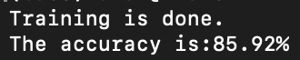

# Vectorized impelementation of Multinomial naive bayes text classifier

Multinomial Naive Bayes algorithm is a probabilistic learning method that is mostly used in Natural Language Processing (NLP). A simple example for Multinomial Bayes classifier is a spam filter. It classifies the message as spam or not spam. What makes the Naive naive is that it understands a text as a composition of words without considering its structure or context. That means it assumes there is no difference between the texts “A man kills a snake” and “The snake kills a man” because their composition is the same.
The interest in the Naive byes classifier is to find the probability of a document being in a specific class given that the document is composed of some words. It uses the Bayes theorem to solve this.

This project implements Multinomial naive bias classifier for text classification in vectorized way instead of the usual for loops

## Getting Started

### Dependencies

* python3.8+
* Numpy
* Pandas

### Installing

```
pip install -r requirements.txt
```

### Executing program

* If you want to test the model do
```
python3 main.py --test --dataset 'path/to/dataset' 
```
* If you want test the prediction of the model do
```
python3 main.py --savemodel
python3 predict.py --test "text to be predicted"
```

* You many need to download the english stop words initially. Do the following.
```
import nltk
nltk.download('stopwords')
```
* If you want to make prediction on texts you enter, you should save the model first.

### Test Results
The following result shows the test of the model on IMDB dataset having 50K movie reviews. The model classifies the movie review to Negative or Positive. You can get the dataset [here](https://www.kaggle.com/datasets/lakshmi25npathi/imdb-dataset-of-50k-movie-reviews)
```
python3 main.py --test --savemodel --dataset './data/IMDB Dataset.csv'
```

```
python3 predict.py --text 'Totally not about computers and networks. Very disappointed. Just some Chinese guy hitting people'
```

```
python3 predict.py --text 'Totally complete sci-fi comic book action movie with an excellent performance from Downey supported by a simple but solid script, superb effects and brilliant score'
```

